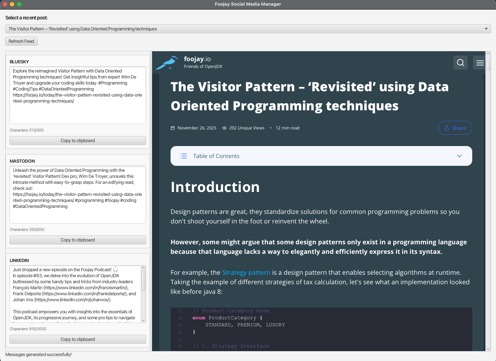

# Foojay Social Poster

Little JavaFX project that:

* Gets the RSS Feed from Foojay
* Shows the latest posts in a dropdown
* After selecting a post:
    * Shows the post in the preview window
    * Loads the author profile(s) to include correct links
    * Generates messages in the correct format with a maximum length

Still to do:

* Publish messages directly with a push on the button, but maybe that's not the ideal approach as a manual step may still be needed to valid the links to the authors.

## Configuration

This project is based on Java and JavaFX 25.

To use this project, you need to create the file `application.properties` in `src/main/resources`, with the following
content:

```text
OPENAI_API_KEY=sk-...
```

## Screenshot

